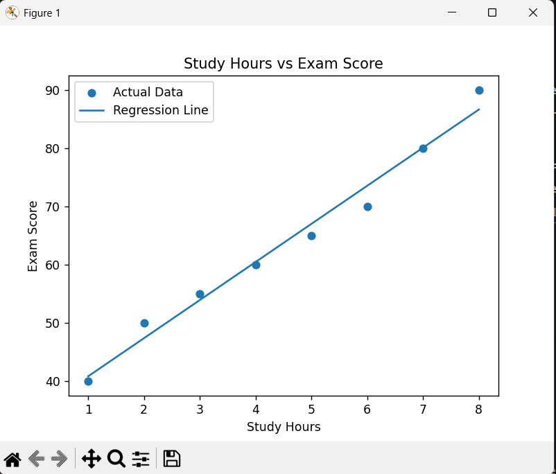

# 📊 Student Performance Analysis

## 🔍 Project Overview

This project analyzes how study time affects student exam performance.
The objective is to identify patterns and quantify the relationship between study hours and scores using data analysis and visualization techniques.

---

## 📁 Dataset

The dataset consists of:

* **Study_Hours** – Number of hours a student studies
* **Score** – Exam score obtained

This is a simulated dataset created for learning purposes.

---

## ⚙️ Tools & Technologies

* Python
* Pandas
* Matplotlib
* (Optional upgrade: Scikit-learn)

---

## 📈 Methodology

1. Data creation and preprocessing
2. Exploratory Data Analysis (EDA)
3. Correlation analysis
4. Data visualization (scatter plot)
5. (Optional) Linear Regression modeling

---
## 📊 Visualization



## 📌 Key Insights

* Strong **positive correlation** between study hours and scores
* Students who study more tend to perform better
* Trend suggests a near-linear relationship

---

## 🤖 (Optional Upgrade) Model Performance

A simple Linear Regression model was applied:

* Model: Linear Regression
* Result: Increasing study hours leads to higher predicted scores
* (Add accuracy or R² if you implement it)

---

## 🚀 How to Run

1. Clone this repository
2. Install required libraries:

   ```
   pip install pandas matplotlib
   ```
3. Run the Python script:

   ```
   python student_analysis.py
   ```

---

## 📌 Future Improvements

* Use real-world dataset
* Add more variables (sleep, attendance, etc.)
* Apply advanced ML models

---

## 👨‍💻 Author

**Anantha Mukesh Paandithevan**
Data Science Student @ Multimedia University (MMU)
